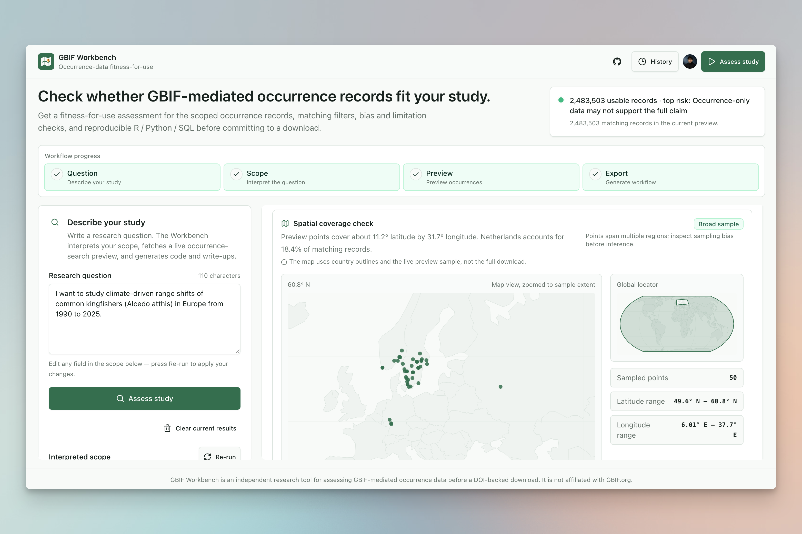
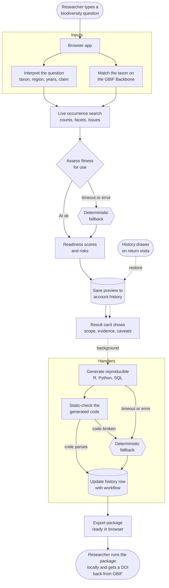

# GBIF Workbench

[](https://github.com/takitajwar17/gbif-workbench/actions/workflows/ci.yml)

GBIF Workbench is a bias-aware pre-download research workbench for GBIF-mediated occurrence data. It helps researchers decide whether, when, and how occurrence records can support a proposed study before they request a DOI-backed GBIF download.

GBIF Workbench is independent software. It is not affiliated with, endorsed by, or operated by GBIF.org.

Public app: https://gbifworkbench.org/

Source repository: https://github.com/takitajwar17/gbif-workbench

License: MIT

The app uses a small Node/Express API. OpenAI structured outputs interpret the user's research question and generate richer fitness-for-use assessment and workflow text, while deterministic fallback paths keep assessment and exports usable if optional AI calls time out. Public GBIF APIs resolve taxa and fetch live occurrence-search preview facts. The browser renders only live API results; demo prompts are only text starters and never load canned GBIF output.

## Why it exists

Researchers often download GBIF-mediated occurrence records first and reason about fitness-for-use later. GBIF Workbench reverses that workflow:

1. Enter a research question.
2. Confirm taxon, region, date range, and analysis type.
3. Preview GBIF occurrence availability with aggregated occurrence-search facets.
4. Separate data availability from data suitability and claim strength.
5. Export a reproducible occurrence-download workflow and report.

GBIF Workbench is deliberately not a generic biodiversity chatbot, not a full modelling platform, and not a universal data-quality score.



## How it works



A typical run flows top to bottom across four lanes:

1. **Interpret.** The researcher's plain-language question becomes a structured study scope (taxon, region, year window, intended claim) and the taxon is resolved against the GBIF Backbone.
2. **Preview.** GBIF Workbench fetches a live occurrence-search preview for the exact scope: matching records, usable coordinates, year and country facets, datasets, issue flags, and a sampling-event discovery signal.
3. **Assess and export.** A fitness-for-use assessment separates data availability from claim strength. If the optional AI step times out, a deterministic fallback produces the same shape from the live preview. A reproducible R / Python / SQL export package follows; if the generated code fails to parse, a hand-written fallback ships instead.
4. **Persist and reuse.** A preview-ready row saves to the signed-in researcher's history as soon as the assessment card is ready, then is updated when the workflow exports finish. The researcher runs the exported package locally with their own GBIF credentials and gets a citable DOI back from GBIF. The history drawer restores a previous analysis in one click.


## Run locally

```bash
cd apps/web
npm install
cp .env.example .env
npm run dev
```

Fill `apps/web/.env` with:

- `OPENAI_API_KEY`
- `VITE_CLERK_PUBLISHABLE_KEY`
- `CLERK_SECRET_KEY`

Create a Clerk app with Google sign-in enabled, then copy the publishable and secret keys into `.env`. If you use the Clerk CLI, authenticate with `clerk auth login` and initialize the local app by selecting your Clerk project interactively.

Account history uses a Vercel Marketplace Neon/Postgres database. Add the Neon integration to the Vercel project and pull env vars so `DATABASE_URL` is present locally:

```bash
cd apps/web
vercel link
vercel integration add neon --name gbif-workbench-history --plan free_v3 -m region=iad1 -m auth=false
vercel env pull .env.local
```

Then open the local URL printed by Vite. The dev script starts both the API server and Vite.

## Verify

```bash
cd apps/web
npm run lint
npm run test
npm run check:runnable
npm run check:validator
npm run build
```

## Capabilities

- Natural-language parsing for taxon, region, years, and intended analysis.
- Demo prompt starters that populate the question field without bypassing live analysis.
- Researcher-focused shadcn/ui + Tailwind interface with accessible forms, cards, tabs, alerts, and export controls.
- Parse-only scope interpretation before the heavier live occurrence-search preview.
- OpenAI Responses API structured outputs for intent extraction, fitness-for-use assessment, and workflow text. Intent failures surface as errors (intent is required); assessment and workflow have deterministic fallbacks grounded in the live occurrence-search preview.
- Clerk account auth and Vercel-backed analysis history, with restore/delete controls for saved assessments that update when workflow exports finish.
- Editable interpreted scope before and after preview, including spatial resolution and user skill level.
- GBIF Backbone taxon resolution through `species/match` and `species/search`.
- Public GBIF occurrence-search preview through `occurrence/search` counts, facets, issue flags, taxonomic breakdown, coordinate uncertainty, and sample points.
- Model-generated data-type fit assessment for distribution/range-shift questions versus abundance/trend questions, grounded in the live occurrence-search preview.
- Bias/risk cards for spatial, temporal, source, taxonomic, citation, and occurrence-only mismatch risks.
- Generated GBIF.org occurrence search URL, occurrence-search API URL, rgbif workflow, Python workflow, GBIF occurrence download predicate JSON, SQL/cube starter query, cleaning pipeline, methods text, limitations text, and citation instructions.
- Markdown, HTML, complete analysis JSON, deterministic analysis summary, predicate JSON, SQL, Quarto, Jupyter, and ZIP export from the browser.
- Short-lived server-side GBIF response caching.

## Important limitation

The occurrence-search preview does not create a GBIF download DOI. Serious research reuse should run the generated `rgbif::occ_download()` workflow or create a GBIF occurrence download through GBIF.org/API, then cite the resulting DOI. The app makes this visible in every generated report.

## Repository Layout

```text
apps/web/                        React 19 + Vite app, Express/Vercel serverless API
apps/web/api/                   Vercel serverless function entry points
  health.js, history.js, parse-intent.js, study-plan.js, workflow.js
apps/web/server/                OpenAI, GBIF, auth, history, and orchestration logic
apps/web/server/lib/            Pure helpers, deterministic fallbacks, and validators
  readinessFormula.js           literature-grounded 4-dimension readiness rubric
  fallbackTriage.js             rule-based risk card when the AI assessment fails
  fallbackWorkflow.js           hand-written R, Python, and cleaning exports
  codeValidator.js              static R + Python parse check on AI-emitted code
  retryPolicy.js                exponential-backoff + token-budget escalation
  fallbackPolicy.js             transient-failure classifier for AI calls
  openaiSchemas.js              strict JSON schemas for the three AI calls
  openaiPrompts.js              guarded instructions + off-topic sentinel
  gbifQueryBuilders.js          URL, predicate, and SQL/cube builders
  lruTtlCache.js                shared LRU+TTL cache factory
apps/web/src/                   React client
  hooks/useAnalyze.ts           workspace state machine (race-safe, abort-aware)
  components/                   ui · form · question · preview · triage · workflow · header · history · api · layout · steps
  lib/                          browser export package, formatting, map, regions, query guard
apps/web/scripts/
  check-workflow-runnable.mjs   CLI harness: parse-checks generated R/Python
apps/web/.env.example           env var template (OpenAI, Clerk, Neon, retry budgets)
apps/web/vercel.json            Vercel function maxDuration + rewrites
apps/web/components.json        shadcn/ui generator config
docs/architecture.md            system design and request flow
docs/configuration.md           environment, auth, database, and API setup
docs/scientific-guardrails.md  fitness-for-use language and model-output rules
docs/product-demo-video.md      demo video shot list and voiceover script
CONTRIBUTING.md                 local setup and pull request expectations
SECURITY.md                     vulnerability reporting and secret-handling policy
CODE_OF_CONDUCT.md              contributor conduct expectations
```

## Contributing

Issues and pull requests are welcome. Please read `CONTRIBUTING.md` and keep changes aligned with the scientific guardrails in `docs/scientific-guardrails.md`.
